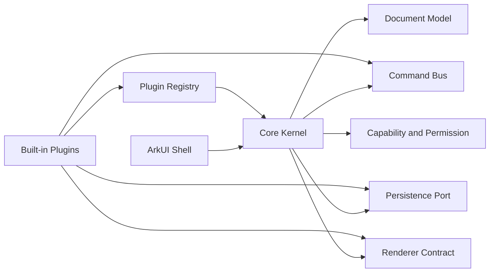

# 核心框架与插件化运行时审查

结论：可以收敛为“稳定核心框架 + 受控插件”，但不建议做到“一切皆插件”。文档模型、命令、持久化、渲染契约、权限和生命周期必须留在核心；工具、面板、导入导出、AI Provider、滤镜和设备能力适合通过插件扩展。

## 为什么不做一切皆插件

- 文档和命令是数据一致性的根。把它们插件化会导致撤销、保存、协作和迁移没有唯一真相。
- 渲染和持久化是发布门禁的基础设施，必须可预测、可审计，不能由任意插件替换。
- 插件需要版本、权限、资源和失败隔离。全部能力都走插件会增加启动顺序、升级和故障恢复成本。
- HarmonyOS 正式包优先采用编译期注册的内置插件；首版不下载或执行未知代码，避免供应链和动态代码风险。

## 核心边界



核心必须提供以下稳定接口：

1. `DocumentModel`：唯一文档/场景/图层/对象模型和 schema 版本迁移。
2. `CommandBus`：命令校验、事务边界、撤销重做、审计事件。
3. `PersistencePort`：保存、恢复、导出文件的原子提交和错误码。
4. `RendererContract`：Frame 输入、像素格式、资源生命周期和 Native 错误映射。
5. `PluginRegistry`：插件发现、依赖排序、生命周期、能力声明和健康状态。
6. `PermissionService`：文件、网络、AI、设备能力的最小授权。

核心不应依赖具体工具栏、面板、Provider 或文件格式插件；但插件只能通过这些端口改变文档，不能直接修改核心状态。

## 插件契约

每个插件包含版本化清单和实现：

```ts
interface PluginManifest {
  id: string
  version: string
  apiVersion: string
  kind: 'tool' | 'panel' | 'importer' | 'exporter' | 'provider' | 'filter' | 'device'
  capabilities: string[]
  permissions: string[]
  dependencies?: string[]
}

interface LarkPlugin {
  manifest: PluginManifest
  activate(context: PluginContext): Promise<void>
  deactivate(): Promise<void>
}
```

`PluginContext` 只暴露命令、只读文档查询、渲染端口、持久化端口和受控日志；不暴露 `AppStorage`、Skia 对象、文件描述符或任意 NAPI 句柄。

## 运行时策略

1. 启动阶段加载核心，再校验清单的 `apiVersion`、依赖和权限。
2. 只注册签名/编译期内置插件；插件激活失败时隔离该插件并保留核心编辑、保存和恢复能力。
3. 插件通过 `CommandBus` 提交修改，通过事件订阅刷新 UI；禁止跨插件直接写状态。
4. 导入/导出插件必须返回真实字节和稳定错误码，不能报告“成功”而没有文件。
5. 插件停用后释放订阅、定时器、Native 句柄和网络请求；核心在退出前执行统一清理。
6. 后续若引入动态插件，只允许签名包、声明式资源或受限 WASM 沙箱，并单独增加供应链、回滚和权限门禁。

## 落地顺序

1. 先把现有 `FusionDocumentStore`、`Exporter`、`NativeEngine` 收敛到核心端口，保持行为不变。
2. 建立 `PluginManifest`、`PluginRegistry` 和生命周期测试，先注册内置工具、导出和 AI Provider。
3. 将 `ToolRail`、Inspector tabs、导入导出格式迁移为插件适配器，UI 只渲染注册结果。
4. 增加权限、版本兼容和故障隔离门禁，再评估是否需要外部插件包。

当前建议：第一阶段采用“静态内置插件 + 核心运行时”，不做动态下载执行；这能获得扩展边界，同时保住设备验收、可回滚和安全审计能力。
